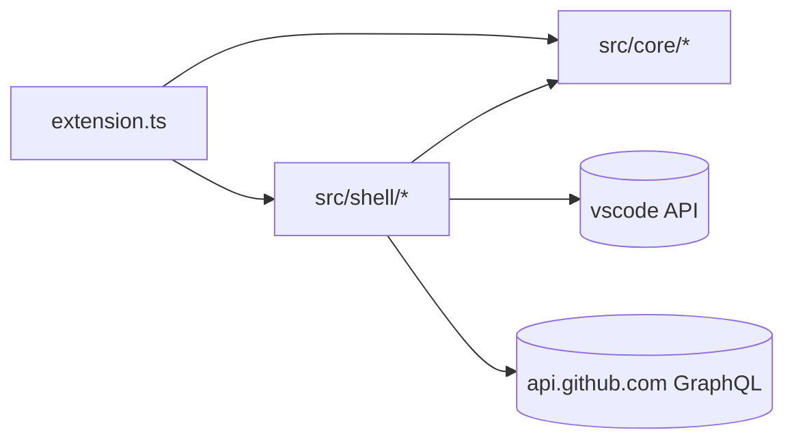
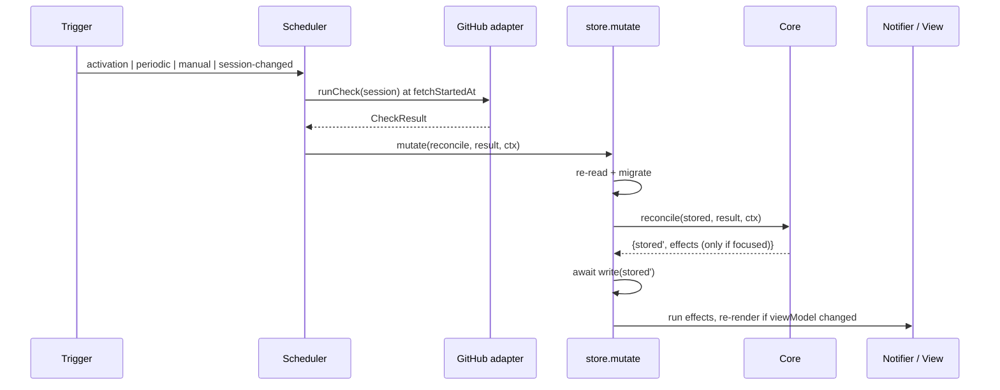
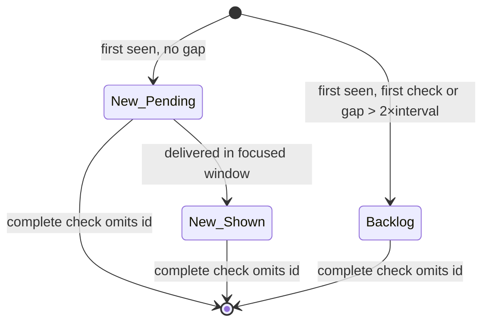

# Architecture Spine — Pulley

## Design Paradigm

**Functional core, imperative shell.** A pure core owns every product rule: queue membership, alert once, backlog, daily reminder, staleness, mascot state, and user-facing copy. A thin shell performs I/O (GitHub, auth, storage, clock, scheduling, VS Code UI) and executes the effects the core returns.

| Layer | Directory | May import | Owns |
| --- | --- | --- | --- |
| Core | `src/core/` | only `src/core/` | Stored-state types, `migrate`, transitions (`reconcile`, `queueViewed`, `windowFocused`), `viewModel`, copy |
| Shell adapters | `src/shell/` | `src/core/`, `vscode`, platform APIs | GitHub query, auth, `store.mutate`, scheduler, notifier, tree view, count |
| Composition | `src/extension.ts` | everything | `activate`/`deactivate` wiring only |



## Invariants & Rules

### AD-1 — Core is pure

- **Binds:** all
- **Prevents:** product rules that can only be tested inside a running VS Code, and logic that behaves differently in tests and in use.
- **Rule:** Code under `src/core/` must not:
  - import `vscode`;
  - perform network or storage I/O;
  - read the clock (`Date.now()`, `new Date()`);
  - call `Math.random`;
  - use timers.

  Time arrives as arguments: `now` (epoch ms) and `today` (the local `YYYY-MM-DD`). Core functions return new values and never mutate their inputs.

### AD-2 — Core transitions are the only deciders

- **Binds:** FR-4, FR-6, FR-7, FR-8, FR-9, FR-10, FR-13
- **Prevents:** "should I alert?" or "is this still pending?" being decided in more than one place.
- **Rule:** Every durable state change is a core transition of the form `(stored, input, ctx) → { stored, effects[] }`:

  | Transition | Runs when |
  | --- | --- |
  | `reconcile` | a check result arrives (success or failure) |
  | `queueViewed` | the Pulley view becomes visible |
  | `windowFocused` | a VS Code window gains focus |

  `ctx` carries `now`, `today`, `windowFocused`, `startupReminderDue`, and the settings. Effects are a closed union: `notifyNew { itemId }` and `notifyBacklog { count, firstConnection }`. The shell never edits state fields and never decides whether to notify. The view renders `viewModel(...)` (AD-12) and never receives effects.

### AD-3 — One write path: `store.mutate`

- **Binds:** FR-7, FR-9, AD-2
- **Prevents:** a window writing a stale copy of state that erases another window's alert history.
- **Rule:** `store.mutate(transition, input, ctx)` is the only caller of `globalState.update`. It runs in this order:
  1. Serialize calls within the window.
  2. Re-read `pulley.state.v1` fresh.
  3. `migrate`.
  4. Apply the transition.
  5. Await the write.
  6. Execute the returned effects, then re-render.

  Effects never run before the write completes. If the stored `schemaVersion` is newer than the running code understands, the window enters read-only mode: no writes and no effects, and the view says "Update Pulley".

### AD-4 — Stored state shape (owned by core)

- **Binds:** FR-6, FR-7, FR-9, FR-10
- **Prevents:** two units storing the same fact in different places, and account switches mixing alert histories.
- **Rule:** The only durable product state is one JSON value in `ExtensionContext.globalState` under `pulley.state.v1`. It is shared across windows of the same VS Code profile, and it is neither `workspaceState` nor a file. Every product field lives inside an account partition:

  ```text
  Stored  = { schemaVersion, accounts: { [accountId]: Account } }
  Account = { firstCheckDone, lastAttemptAt?, lastAttemptIntervalMs?, lastSuccessAt?,
              lastAppliedFetchStartedAt?, lastFailure?: { at, reason },
              lastBacklogReminderDate?, backlogAlert: none|pending|shown(firstConnection?),
              newSignal, items: { [prNodeId]: Tracked } }
  Tracked = { id, repo, number, title, author, url, requester?, requestedAt?,
              firstSeenAt, origin: new|backlog, alert: none|pending|shown }
  ```

  `accountId` is `AuthenticationSession.account.id`. Per-window memory (active account, session generation, `startupReminderDue`, in-flight check) is never persisted. Settings live in VS Code configuration only.

### AD-5 — Check result contract

- **Binds:** FR-4, FR-6, FR-8, FR-11
- **Prevents:** GraphQL shapes leaking into core, a partial result ending cycles, and an older result overwriting a newer one.
- **Rule:** The GitHub adapter returns one of two shapes:
  - Success: `{ ok: true, accountId, fetchStartedAt, complete, items: RequestItem[] }`.
  - Failure: `{ ok: false, accountId?, fetchStartedAt, reason }`.

  Each `RequestItem` is `{ id: PR node id, repo: "owner/name", number, title, author, url, requester?, requestedAt? }`. `complete` is true only when every page was fetched and GraphQL returned no errors.

  `reconcile` enforces three guards:
  - It discards results whose `accountId` isn't the window's active account.
  - It treats a success result whose `fetchStartedAt` ≤ `lastAppliedFetchStartedAt` as a no-op.
  - If a result is incomplete, it only adds or updates items. It never ends a cycle.

  Missing `requester` and `requestedAt` are never substituted with the PR author or PR age.

### AD-6 — Request identity and cycles

- **Binds:** FR-6, FR-7, A1
- **Prevents:** re-alerting the same outstanding request, including after a repo rename or transfer.
- **Rule:** Identity is the PR's GraphQL node `id`. A cycle is open while complete successful checks contain `id`. The first complete successful check that omits it deletes the tracked item and its alert history. A later reappearance is a new cycle. A re-request between checks that keeps `id` present only updates `requester`/`requestedAt`. It does not start a new cycle.

### AD-7 — New vs. backlog classification

- **Binds:** FR-8, FR-9, SM-2
- **Prevents:** alerts lost to outages, sleep, or a newly opened window; individual alerts for requests that arrived while VS Code was closed.
- **Rule:** Every result, successful or failed, sets `lastAttemptAt = fetchStartedAt` and `lastAttemptIntervalMs` to the current interval. A newly observed item is **backlog** when either:
  - `firstCheckDone` is false, or
  - the gap between this `fetchStartedAt` and the previous `lastAttemptAt` exceeds 2 × the previous `lastAttemptIntervalMs`.

  Otherwise it is **new**, and its `alert` becomes `pending`. `origin` is never recomputed. `newSignal` is set when a check adds a `new` item. It is cleared by a successful check that adds none, or by `queueViewed`.

### AD-8 — Backlog reminders

- **Binds:** FR-9, A4
- **Prevents:** reminders on every poll or in every window, and losing the day's reminder when the startup check fails.
- **Rule:** `backlogAlert` becomes `pending` in these cases:
  - **First connection:** the account's first successful check (`firstCheckDone` false) has any items. The alert is marked as a first-connection alert. That check sets `firstCheckDone` whether or not items exist.
  - **Ongoing reminder:** pending items exist, `lastBacklogReminderDate ≠ today`, and one of these is true:
    - `ctx.startupReminderDue`: a per-window flag set at activation and cleared by that window's first successful check;
    - this check classified items as backlog.

  Setting it pending also sets `lastBacklogReminderDate = today`. The backlog threshold changes presentation only (A6).

### AD-9 — Focus-gated delivery

- **Binds:** FR-8, FR-9, SM-2
- **Prevents:** every open window showing the same alert, and alerts landing in a window the user isn't looking at.
- **Rule:** Every window checks and records `pending` alerts. A transition emits `notifyNew`/`notifyBacklog` only when `ctx.windowFocused` is true. In the same write, it marks those alerts `shown`. `windowFocused` delivers anything still pending and re-renders from fresh state. The remaining race, where two windows gain focus within milliseconds of each other, is accepted. Dismissing a notification changes nothing.

### AD-10 — GitHub access: one GraphQL search per check

- **Binds:** FR-2, FR-4, FR-8, FR-11
- **Prevents:** N+1 REST calls, divergent definitions of "direct request", and one unmatched item failing the whole check.
- **Rule:** A check is a paginated GraphQL `search(type: ISSUE, query: "is:pr is:open user-review-requested:@me archived:false", first: 50)`. It fetches, per PR, the `RequestItem` fields and `timelineItems(itemTypes: [REVIEW_REQUESTED_EVENT], last: 10)`. `requester`/`requestedAt` come from the most recent `ReviewRequestedEvent` whose `requestedReviewer` is the viewer. If none matches, the item omits them and the check still succeeds. The adapter pages until `hasNextPage` is false and never truncates silently. HTTP and GraphQL errors map to AD-13 reasons. A response with data plus errors is `complete: false`, and the errors are logged. There is no repository scoping: the scope is account-wide `[ADOPTED]`. The adapter reads no Git remotes and does not depend on `vscode.git`.

### AD-11 — Authentication

- **Binds:** FR-1, FR-3
- **Prevents:** sign-in prompts at startup, tokens stored by Pulley, and results applied to the wrong account.
- **Rule:** Only `vscode.authentication.getSession('github', ['repo'])` is used.
  - On activation, it is called with `silent: true`.
  - `createIfNone: true` is used only from an explicit Connect/Reconnect action.
  - The token is obtained per check and never persisted.
  - On HTTP 401, the shell retries a silent `getSession` once before reporting `unauthenticated`.
  - `onDidChangeSessions` for `github` updates the window's active account, increments its session generation, and triggers a check.

  Results from an older generation are discarded.

### AD-12 — View model contract

- **Binds:** FR-3, FR-5, FR-10, FR-11, FR-13, UX accessibility floor
- **Prevents:** the queue view and the count disagreeing, a zero shown before any successful check, and background polls re-announcing to screen readers.
- **Rule:** The core function `viewModel(stored, window, { now, today, threshold, checking })` returns:

  ```text
  { status: loading|unconnected(reason)|pending|clear|stale|readOnly,
    count: number|null, countStale, lastSuccessAt?, mascot, mascotText, message?, rows[] }
  ```

  - **Count:** `count` is `null` until the account's first successful check.
  - **Stale status:** `stale` applies when `lastFailure.at > lastSuccessAt`.
  - **Rows:** each row carries its title, `repo`, author, `url`, an age string or "Request time unavailable", and a full `accessibleLabel`.
  - **Mascot:** `new|older|backlog|waiting|clear|unknown`. For pending work, precedence is backlog (count ≥ threshold) > new (`newSignal`) > older > waiting. `clear` applies only after a successful zero-result check; `unknown` applies when data is not confirmed pending or clear. An item counts as older only if `requestedAt` is known and at least 24 h before `now`.
  - **Copy:** all copy comes from `src/core/copy.ts`. Rotating backlog lines are chosen by a deterministic function of `today`.

  The shell re-renders the tree and count only when the view model changes.

### AD-13 — Failure is not emptiness

- **Binds:** FR-3, FR-6
- **Prevents:** a failed check presenting a confirmed-clear queue or resetting alert history.
- **Rule:** `reason ∈ { signed_out, unauthenticated, network, rate_limited, graphql_error }`. Each reason maps to one message and action in `copy.ts`: `signed_out` → Connect, `unauthenticated` → Reconnect, and the rest → Refresh. A failed result changes only `lastAttemptAt`, `lastAttemptIntervalMs`, and `lastFailure`. With no session, the unconnected status lives in window memory only.

### AD-14 — Activation and check scheduling

- **Binds:** FR-5
- **Prevents:** Pulley not polling until the view opens, overlapping checks in one window, and windows polling in lockstep.
- **Rule:**
  - **Activation:** `activationEvents` includes `onStartupFinished`. Opening the view is not a trigger.
  - **Triggers:** `activation`, `periodic`, `manual` (Refresh), and `session-changed`.
  - **Concurrency:** at most one check is in flight per window. A trigger during a check joins it.
  - **Jitter:** non-manual triggers get a random 0–60 s jitter in the shell.
  - **Interval changes:** a change to the interval setting restarts the timer. A threshold change only re-renders.
  - **Settings:** both are `application`-scoped. `pulley.checkIntervalMinutes` defaults to 15 (range 5–240). `pulley.backlogThreshold` defaults to 5 (minimum 1).

### AD-15 — Minimal data leaves the machine

- **Binds:** Privacy (cross-cutting quality)
- **Prevents:** accidental telemetry or third-party calls.
- **Rule:** The only network destination is `https://api.github.com/graphql`, plus PR URLs opened in the browser. There is no telemetry, and tokens are never logged. Diagnostics go only to the local "Pulley" output channel.

## Consistency Conventions

| Concern | Convention |
| --- | --- |
| Naming | Everything uses the `pulley.` prefix: commands `pulley.refresh`, `pulley.connect`, `pulley.openPullRequest`; view `pulley.queue`; settings per AD-14. Core types are PascalCase (`Stored`, `Account`, `Tracked`, `RequestItem`, `CheckResult`, `Effect`, `ViewModel`). |
| Time | State stores epoch milliseconds. The local day is `YYYY-MM-DD`, computed in the shell. Age strings are formatted only in `viewModel`. |
| IDs | Items use the PR node `id`. Partitions use `session.account.id`. Display uses `owner/name#number`. |
| Errors | Adapters never throw into the scheduler. They return `{ ok: false, reason }`. Unexpected exceptions map to `graphql_error` and are logged. |
| Copy | All user-facing strings are in `src/core/copy.ts`. Every row and notification names `owner/name`. Clear and unconnected copy notes that only repositories visible to the GitHub sign-in are included. |
| Tests | Core has table-driven unit tests with no VS Code host; every AD-5 through AD-9 rule has a case. The shell has a few `@vscode/test-cli` smoke tests: activation without the view open, `store.mutate` ordering, and the notifier. `migrate` has a test for each stored version. |

## Stack

| Name | Version |
| --- | --- |
| VS Code (current stable at authoring; `engines.vscode` from scaffold) | 1.139 / `^1.138.0` |
| Scaffold: generator-code (`yo code`, TypeScript + esbuild) | 1.12.0 |
| TypeScript (scaffold pin; typescript-eslint does not support TS 7) | 6.0.x |
| esbuild | 0.28.x |
| Node.js (CI and tooling; ≥ 22 required by vsce 4) | 24 LTS |
| @vscode/test-cli / @vscode/test-electron | 0.0.15 / ^3.1 |
| @vscode/vsce | 4.0.0 |
| GitHub API | GraphQL v4 via built-in `fetch` (no client library) |

## Structural Seed

```text
pulley/
  src/
    extension.ts          # activate/deactivate: wiring only
    core/                 # pure: types, migrate, reconcile, queueViewed, windowFocused, viewModel, copy
    shell/
      github.ts           # GraphQL query + normalization → CheckResult
      auth.ts             # session, active account, generation
      store.ts            # store.mutate (AD-3)
      scheduler.ts        # triggers, jitter, single in-flight check
      notifier.ts         # executes notifyNew / notifyBacklog
      queueView.ts        # TreeDataProvider over ViewModel
      statusCount.ts      # quiet count (placement per UX)
  test/
    core/                 # unit tests, no VS Code
    smoke/                # @vscode/test-cli
  .github/workflows/ci.yml
```





```mermaid
flowchart LR
  dev[Developer machine] -- vsce package --> vsix[.vsix]
  ci[GitHub Actions: test + package] --> vsix
  vsix -- manual share --> dogfood[Dogfood testers]
  vsix -- vsce publish --azure-credential --> mkt[VS Code Marketplace]
  ext[Installed extension] -- HTTPS GraphQL --> gh[api.github.com]
```

## Release & Operations

- **Environments:** local Extension Development Host and installed builds only. There is no server, no hosted infrastructure, and no stored secrets. Marketplace publishing authenticates with Microsoft Entra ID (`--azure-credential`), not a long-lived PAT.
- **Identity:** the extension ID (publisher + `pulley`) is fixed before the first distributed `.vsix` and never changes, because `globalState` is keyed by it.
- **Versioning:** SemVer, with the same version in the `.vsix` and on the Marketplace. Any incompatible stored-state change bumps `schemaVersion`, adds a `migrate` step and its test, and keeps the `pulley.state.v1` key unless migration is impossible.
- **Support:** users send diagnostics from the "Pulley" output channel. There is no remote logging.

## Capability → Architecture Map

| Capability / Area | Lives in | Governed by |
| --- | --- | --- |
| FR-1 connection | `shell/auth.ts` | AD-11 |
| FR-2 scope (account-wide) | `shell/github.ts` query | AD-10 |
| FR-3 unavailable data | `core/viewModel`, `core/copy` → `queueView` | AD-12, AD-13 |
| FR-4 find direct requests | `shell/github.ts` | AD-5, AD-10 |
| FR-5 cadence, last check time | `shell/scheduler.ts`, `core/viewModel` | AD-12, AD-14 |
| FR-6 queue accuracy | `core/reconcile` | AD-5, AD-6, AD-13 |
| FR-7 durable alert history | `core` types + `shell/store.ts` | AD-3, AD-4, AD-6 |
| FR-8 new-request alert | `core/reconcile` → `shell/notifier.ts` | AD-7, AD-9, AD-10 |
| FR-9 backlog reminder | `core/reconcile`, `core/windowFocused` | AD-7, AD-8, AD-9 |
| FR-10, FR-13 mascot and count | `core/viewModel` → `queueView`, `statusCount` | AD-12 |
| FR-11, FR-12 rows, open PR | `core/viewModel` → `queueView` | AD-5, AD-12 |
| Privacy | all shell adapters | AD-15 |

## Open Questions

- **CI:** GitHub Actions running tests and packaging on push is assumed. Confirm before the release story.
- **Publisher ID:** must be chosen before the first dogfood `.vsix` (see Release & Operations).
- **Live behavior of AD-10:** the first integration story is a spike that runs the query on real repositories. It checks bot and automation requesters, organizations with SSO/OAuth restrictions (partial errors), and cross-window `globalState` propagation delay.

## Deferred

- **Fine-grained permissions (GitHub App instead of the `repo` scope):** a large build cost. Revisit if dogfood testers object to the permission prompt.
- **Detecting organizations that block VS Code's OAuth app:** their PRs are absent, and copy mitigates this. Revisit after dogfooding.
- **Pulley in multiple VS Code profiles:** each profile has separate `globalState`, so it behaves as a separate install.
- **Open VSX / Cursor distribution, GitHub Enterprise, webhooks, browser-hosted VS Code:** outside the MVP per the PRD.
- **Row visuals, count placement (badge vs. status bar), corgi artwork:** owned by `DESIGN.md`/`EXPERIENCE.md`. They consume only the view model.
